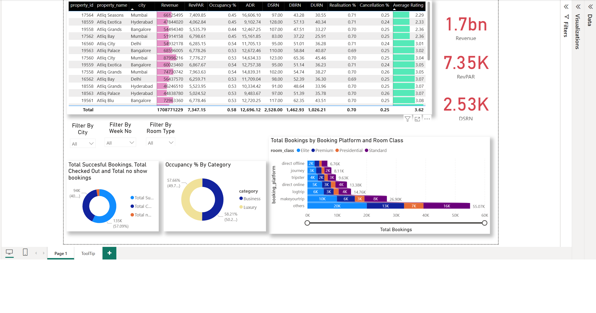

# Hospitality Domain Data Analysis

Welcome to the **Hospitality Domain Data Analysis** project! This repository contains a comprehensive Level 1 analysis of revenue in the hospitality sector, leveraging real-world booking and hotel data.

---

## 📊 Dashboard Preview

<!-- Replace the link below with your dashboard image -->


---

## 🗂️ Repository Structure

- `dim_date.csv` — Date dimension table with day types and week numbers
- `dim_hotels.csv` — Hotel dimension table
- `dim_rooms.csv` — Room dimension table
- `fact_bookings.csv` — Raw booking facts
- `fact_aggregated_bookings.csv` — Aggregated booking facts
- `Hospitality Domain L1 Analysis.pbix` — Power BI dashboard file
- `metrics list.xlsx` — List of metrics used in analysis
- `README.md` — Project documentation

---

## 🚀 Getting Started

1. **Clone the repository**
   ```sh
   git clone https://github.com/yourusername/Hospitality-Domain-Data-Analysis.git
   ```

2. **Open the Power BI dashboard**
   - Use [Hospitality Domain L1 Analysis.pbix](Hospitality%20Domain%20L1%20Analysis.pbix) in Power BI Desktop.

3. **Explore the data**
   - All CSV files are ready for analysis and can be loaded into your preferred analytics tool.

---

## 📈 Key Metrics & Insights

- **Revenue Trends**: Analyze revenue across hotels, room types, and time periods.
- **Booking Patterns**: Discover booking behaviors by weekdays, weekends, and seasons.
- **Hotel Performance**: Compare performance metrics across different hotels.
- **Room Analysis**: Evaluate occupancy and revenue by room category.

---

## 🛠️ Tools Used

- **Power BI** for interactive dashboarding
- **Excel** for metric tracking
- **CSV** for structured data storage

---

## 💡 How to Contribute

Feel free to fork the repo, open issues, or submit pull requests for improvements, new metrics, or visualizations!

---

## 📬 Contact

For questions or collaboration, reach out via [GitHub Issues](https://github.com/yourusername/Hospitality-Domain-Data-Analysis/issues).

---

> _Level 1 Analysis of Revenue in Hospitality Domain_
